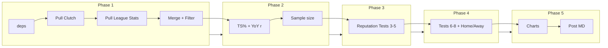

# NBA Clutch Myth Analysis — Phased Pipeline Plan

## Current state

- **Workspace:** Empty (`c:\Users\yuvi2\Downloads\Clutchness Hypothesis`). No code, no `outputs/`, no dependencies.
- **Deliverables:** `requirements.txt`; a single main script (or modular scripts) that run in order; `outputs/charts/` (7 PNGs); `outputs/clutch_analysis.md` (full post).

## Architecture (high level)

---

## Phase 1 — Setup and data pull (verify before moving on)

**Goal:** Install deps, pull all raw data, merge on player+season, apply minimum games filter, confirm shapes and log dropouts.

1. **Project layout**
  - Create `requirements.txt`: `nba_api`, `pandas`, `numpy`, `scipy`, `matplotlib`, `seaborn` (pinned versions recommended).
  - Create `outputs/` and `outputs/charts/`.
  - Single entrypoint script (e.g. `run_analysis.py`) or a small module set (e.g. `data/`, `analysis/`, `charts/`, `post/`) with one driver script.
2. **Dependencies and rate limiting**
  - `pip install -r requirements.txt`.
  - After every nba_api request: `time.sleep(1)` (and optionally retry on 429/5xx) to avoid rate limits. Wrap all API calls in try/except; log failures and re-raise or exit so runs are traceable.
3. **Seasons and clutch definition**
  - Seasons: `2017-18` through `2024-25` (8 seasons).
  - Clutch: Last 5 minutes, score within 5 points (align with API: `ClutchTime="Last 5 Minutes"`, `PointDiff=5`, `AheadBehind="Ahead or Behind"`).
4. **Pull LeagueDashPlayerClutch (all 8 seasons)**
  - Endpoint: `nba_api.stats.endpoints.LeagueDashPlayerClutch`.
  - Parameters: `season=YYYY-YY`, `clutch_time="Last 5 Minutes"`, `ahead_behind="Ahead or Behind"`, `point_diff=5`, `measure_type_detailed_defense="Base"`, `per_mode_detailed="Totals"`, `season_type_all_star="Regular Season"`.
  - For **Test 5 (usage spike)** also pull once per season with `measure_type_detailed_defense="Usage"` to get USG% (confirm column name, e.g. `USG_PCT`).
  - After each pull: `df.shape`, `df.head()`, and basic null check; log and persist (e.g. CSV in `outputs/` or a `data/` folder) so Phase 1 can be verified without re-calling the API.
5. **Pull LeagueDashPlayerStats (all 8 seasons)**
  - Endpoint: `nba_api.stats.endpoints.LeagueDashPlayerStats`.
  - Same `season` and `season_type_all_star="Regular Season"`; per_mode Totals.
  - Log shape/head; persist.
6. **Merge and filter**
  - Merge clutch and league stats on `PLAYER_ID` + `season` (add `season` column to each pull). Use outer join and then flag/lossy inner: log rows lost in join (player-seasons in one source but not the other).
  - Filter: keep only player-seasons with **GP >= 10** (clutch games played from clutch dataframe). Drop and log each dropped player-season (e.g. to `outputs/dropped_insufficient_sample.csv` or a log file).
  - Final merged table: one row per (player_id, player_name, season) with clutch and overall stats. Confirm row count and column set; this is the main “core” dataframe for Tests 1–5 and for identifying reputation players.

**Verification gate:** Script runs without API errors; shapes and row counts logged; dropped player-seasons documented; at least one season’s merged dataframe saved and inspectable (e.g. CSV or head printed).

---

## Phase 2 — Core metrics and Tests 1–2 (consistency and sample size)

**Goal:** Compute clutch TS%, overall TS%, year-over-year correlation, and average clutch vs total possessions; verify numbers before charts.

1. **True Shooting**
  - **Clutch:** `TS% = PTS / (2 * (FGA + 0.44 * FTA))` using clutch FGA, FTA, PTS from LeagueDashPlayerClutch.
  - **Overall:** Same formula using LeagueDashPlayerStats. Handle FTA=0 (avoid div-by-zero).
  - Add columns: `clutch_ts`, `overall_ts`.
2. **Test 1 — Year-over-year consistency**
  - Build a panel: for each player, pair (clutch_ts in year N, clutch_ts in year N+1) for N in 2017-18..2023-24. Only use player-seasons that passed the 10-game filter in both N and N+1.
  - Run **Pearson correlation** (scipy.stats.pearsonr) on paired (year N clutch TS%, year N+1 clutch TS%). Record and display **r** and p-value.
  - Expected: r < 0.3 (weak consistency). Document in a small results dict or module-level constants for use in the post and Chart 1.
3. **Test 2 — Sample size**
  - **Clutch “possessions”:** Approximate with `FGA + 0.44*FTA + TOV` from clutch data (or use FGA+FTM as a simpler proxy if you prefer; document choice). Alternatively use MIN and league pace to estimate possessions; keep method consistent.
  - **Total season possessions:** Same formula from LeagueDashPlayerStats (or from league totals) for each player-season.
  - Compute per player-season: clutch possessions, total possessions, ratio (clutch / total). Then **average across all player-seasons** (or median): “average clutch possessions per player per season” and “average share of possessions that are clutch.”
  - Store aggregates for Chart 2 (e.g. one row: avg_clutch_poss, avg_total_poss, ratio).

**Verification gate:** r and p-value printed; average clutch possessions and proportion printed; no NaNs in key metrics. Optional: quick sanity plot of YoY scatter (can replace with final Chart 1 later).

---

## Phase 3 — Reputation players and Tests 3, 4, 5 (TS% split, FT-stripped, usage spike)

**Goal:** Resolve 10 reputation players to IDs, then run clutch vs overall TS%, FT-stripped clutch efficiency, and clutch vs overall USG%.

1. **Reputation player IDs**
  - List: LeBron James, Damian Lillard, Kawhi Leonard, Kyrie Irving, Jimmy Butler, Chris Paul, Steph Curry, Luka Doncic, Devin Booker, Paul George.
  - Use `nba_api.stats.static.players.find_players_by_full_name(...)` for each; take first match and store `player_id`. Log and handle duplicates/retired (e.g. Chris Paul may be same ID across years). Build a dict or table: name -> id.
2. **Test 3 — Clutch vs overall TS%**
  - From the core merged dataframe, filter to the 10 reputation player_ids across all seasons they appear (with GP >= 10 in clutch). Aggregate per player (e.g. sum FGM/FGA/FTA/PTS over seasons, or use per-season then average; document “career” vs “per-season” — per-season average is more comparable). Compute clutch_ts and overall_ts for each player.
  - Produce a table: player_name, clutch_ts, overall_ts, (optional) diff. Identify who is *worse* in clutch than overall for narrative.
3. **Test 4 — FT-stripped clutch efficiency**
  - **FT-stripped formula (clutch only):** `Points_from_FGM_only / (2 * FGA)` where points from FGM = 2*2PM + 3*3PM (use FGM, FG3M: 2PM = FGM - FG3M). Use clutch FGA, FGM, FG3M from LeagueDashPlayerClutch.
  - Compute for each reputation player (same aggregation as Test 3): standard clutch TS% and FT-stripped clutch efficiency. Flag players whose clutch reputation is heavily FT-dependent (e.g. big drop when stripping FTs).
4. **Test 5 — Usage spike**
  - Pull LeagueDashPlayerClutch with **MeasureType Usage** for all 8 seasons (if available; else compute USG% from box if possible). Pull LeagueDashPlayerStats with Advanced or Usage measure for overall USG% (or compute from FGA, FTA, TOV, MIN, team totals if needed).
  - For each reputation player (across seasons): average clutch USG%, average overall USG%, and % spike. Store for Chart 4.

**Verification gate:** All 10 players resolved; Tables for Tests 3, 4, 5 printed or saved (e.g. CSV); no missing values for these players in the core stats used.

---

## Phase 4 — Tests 6, 7, 8 (isolation/assisted, home/away, miss rate) and caveats

**Goal:** Home/away clutch split, miss rate for 3 “mythology” players, and assisted vs unassisted (with a clear fallback if data is missing). Document caveats.

1. **Test 6 — Assisted vs unassisted FGM (isolation rate)**
  - **Data reality:** `ShotChartDetail` does **not** include an “assisted” flag; it has shot location and ACTION_TYPE, not pass attribution. True assisted/unassisted requires **play-by-play**: e.g. `PlayByPlayV2` per game, filter to clutch segment (last 5 min, 5-pt diff), then match FGM events to prior assist events by player.
  - **Recommended approach:** For each reputation player and season, get list of game_ids where they played; fetch PlayByPlayV2 for those games (with rate limiting); restrict to clutch period; parse event descriptions or event type to mark FGM as assisted vs unassisted; aggregate clutch assisted FGM / total clutch FGM and same for non-clutch (e.g. from same play-by-play or from ShotChartDetail non-clutch). If this is too heavy (API volume), **fallback:** (a) compute **clutch AST%** or **ratio of clutch FGM to clutch AST** from LeagueDashPlayerClutch (narrative: “ball movement in clutch”) or (b) state limitation in the post and skip Chart for Test 6, or add a simple “clutch AST per game vs non-clutch” comparison from box scores only. Plan should explicitly choose one path and document it in the post.
2. **Test 7 — Home vs away clutch split**
  - **LeagueDashPlayerClutch** supports `location_nullable`: `"Home"` and `"Road"`. Pull clutch data **twice per season** (Home and Road), merge so you have clutch_ts_home and clutch_ts_away per (player_id, season). Filter to reputation players; aggregate (e.g. average) across seasons per player. Use for Chart 6 and narrative “does clutch travel?”
3. **Test 8 — Memory bias (miss rate)**
  - Pick **3 “mythologized”** clutch players (e.g. from the 10: e.g. Damian Lillard, LeBron James, Kyrie Irving — or let the narrative choose). From clutch data: total FGA, FGM → miss rate = (FGA - FGM) / FGA. Present plainly; use for Chart 7 (“What Fans Forget”).
4. **Outliers (repeatable clutch)**
  - From Test 1’s year-over-year panel, compute **per-player** correlation of (year N clutch TS%, year N+1 clutch TS%) where possible (e.g. at least 3 pairs). Flag players with r > 0.5 as “repeatable clutch” for the Verdict section.
5. **Documentation and caveats**
  - Log: player-seasons dropped (Phase 1); any rate-limit events; **era note** (pace/rule changes 2017–2025); **survivorship bias** (stars get clutch opportunities; role players on bad teams underrepresented). Add these as comments or a small `caveats.md` / section in the script so the post author can reference them in Section 4 (The Wrinkle).

**Verification gate:** Home/away and miss-rate numbers computed and saved; Test 6 approach implemented or fallback documented; outlier list (r > 0.5) ready; caveats written.

---

## Phase 5 — Charts and post

**Goal:** Generate all 7 charts with a consistent editorial style; write the full Substack post referencing the stats and charts.

1. **Chart style (all charts)**
  - Dark background (e.g. `#1a1a2e`); clean sans-serif font (e.g. Arial or a Google font); minimal chart junk; editorial look. Save under `outputs/charts/` with exact filenames below.
2. **Charts to generate**
  - **year_over_year_scatter.png** — Scatter: clutch TS% year N (x) vs year N+1 (y); regression line; display r on plot. Title: “Is Clutch Repeatable?”
  - **sample_size_bar.png** — Bar: avg clutch possessions vs avg total possessions per season (or proportion). Title: “How Many Clutch Moments Does a Star Actually Get?”
  - **clutch_vs_overall_ts.png** — Grouped bar: clutch TS% vs overall TS% for 10 reputation players. Highlight worse-in-clutch. Title: “Are Clutch Players Actually Better Under Pressure?”
  - **usage_spike.png** — Grouped bar: clutch USG% vs overall USG% for reputation players. Title: “The Ball Always Goes to the Star — Is That Clutch or Just Habit?”
  - **ft_stripped.png** — Grouped bar: standard clutch TS% vs FT-stripped clutch efficiency for reputation players. Title: “How Much of Clutch Scoring Is Actually Free Throws?”
  - **home_away_split.png** — Grouped bar: home clutch TS% vs away clutch TS% for reputation players. Title: “Does Clutch Travel?”
  - **miss_rate.png** — Bar: clutch FGA miss rate for 3 mythology players. Title: “What Fans Forget.”
3. **Post — clutch_analysis.md**
  - Path: `outputs/clutch_analysis.md`. Structure and length: **Hook (~150)** → **Setup (~200)** → **Data (~450)** → **Wrinkle (~250)** → **Verdict (~150)**; total 1,100–1,300 words. Tone: confident, narrative-first, “wait, is that actually true?”; stats serve the story.
  - **Section 1 — Hook:** Iconic clutch moment, then “But here’s what the data says.” Lead with the most surprising stat (sample size or miss rate). End with: “What if clutch is mostly a story we tell ourselves after the fact?”
  - **Section 2 — Setup:** Define clutch (last 5 min, within 5 pts). Why people believe (narrative, recency bias, media). What we’re testing and why year-over-year consistency is the right test.
  - **Section 3 — Data:** Findings in narrative order: (1) sample size, (2) YoY r, (3) clutch vs overall TS% for reputation players, (4) FT-stripped finding, (5) usage spike. Reference charts inline: `[see Chart X]` or embed image paths.
  - **Section 4 — Wrinkle:** What numbers can’t capture: isolation context, defensive gameplanning, home crowd (use home/away), memory bias (miss rate), survivorship bias, era. Close with: “The numbers don’t say clutch doesn’t exist. They say most clutch reputations are built on 4 or 5 moments that happened to be on television at the right time.”
  - **Section 5 — Verdict:** Name 2–3 outliers (r > 0.5). Punchy close: “Clutch is real. Clutch reputations mostly aren’t.”

**Verification gate:** All 7 PNGs present in `outputs/charts/`; word count of markdown in range; all sections present and charts referenced.

---

## Data and API notes

- **nba_api endpoints:** `LeagueDashPlayerClutch` (Base + Usage), `LeagueDashPlayerStats`, `PlayerDashboardByClutch` (if needed for home/away; otherwise LeagueDashPlayerClutch with `location_nullable`), `ShotChartDetail` (clutch filter available; no assisted flag), `PlayByPlayV2` (for Test 6 if implementing full assisted/unassisted).
- **Minimum threshold:** 10 clutch games (GP >= 10) per player-season; drop and log others.
- **Season format:** `"2017-18"` through `"2024-25"`.
- **TS%:** `PTS / (2 * (FGA + 0.44 * FTA))`. FT-stripped (clutch): `(2*(FGM-FG3M) + 3*FG3M) / (2*FGA)`.

---

## File manifest (final)

| Path                                               | Description                                                      |
| -------------------------------------------------- | ---------------------------------------------------------------- |
| `requirements.txt`                                 | nba_api, pandas, numpy, scipy, matplotlib, seaborn               |
| `run_analysis.py` (or modular equiv.)              | Single entrypoint; phases 1–5 in order; verification prints/logs |
| `outputs/dropped_insufficient_sample.csv` (or log) | Dropped player-seasons                                           |
| `outputs/charts/year_over_year_scatter.png`        | Chart 1                                                          |
| `outputs/charts/sample_size_bar.png`               | Chart 2                                                          |
| `outputs/charts/clutch_vs_overall_ts.png`          | Chart 3                                                          |
| `outputs/charts/usage_spike.png`                   | Chart 4                                                          |
| `outputs/charts/ft_stripped.png`                   | Chart 5                                                          |
| `outputs/charts/home_away_split.png`               | Chart 6                                                          |
| `outputs/charts/miss_rate.png`                     | Chart 7                                                          |
| `outputs/clutch_analysis.md`                       | Full Substack post                                               |

---

## Suggested execution order

Run Phase 1 end-to-end and confirm shapes/drops before coding Phase 2. After Phase 2, confirm r and sample-size numbers. After Phase 3, confirm reputation player tables. After Phase 4, confirm home/away, miss rate, and Test 6 approach. Finally run Phase 5 to generate charts and write the post. Optional: add a `--phase 1|2|3|4|5` flag so you can re-run from a given phase without re-pulling data (e.g. cache raw data after Phase 1).