# The Clutch Hypothesis: A Statistical Investigation of Repeatability in NBA Late-Game Performance

**Research Report**  
*Grade Level: Advanced High School / Introductory College*

---

## Abstract

This report tests whether "clutch" performance—defined as player efficiency in the last five minutes when the score is within five points—is a repeatable skill in the NBA. Using eight seasons of official league data (2017-18 through 2024-25), we find a year-over-year Pearson correlation of *r* = 0.074 for clutch true shooting percentage, indicating that clutch performance in one season predicts almost nothing about the next. We further analyze 22 "reputation" players with established clutch narratives, finding that 19 of 22 shoot *worse* in clutch than overall, that ball movement collapses in clutch time, and that 102 non-star players outperformed their normal efficiency in clutch situations. We conclude that clutch, as a repeatable shooting skill, does not hold up to statistical scrutiny.

---

## 1. Introduction

### 1.1 Research Question

Is clutch performance in the NBA a **repeatable skill**—that is, do players who shoot well in clutch situations one year tend to shoot well the next? Or is "clutch" largely noise, narrative, and selective memory?

### 1.2 Hypothesis

**Null hypothesis (H0):** Clutch true shooting percentage (TS%) is repeatable across seasons; year-over-year correlation is moderate to strong (*r* >= 0.3).

**Alternative hypothesis (H1):** Clutch TS% is not repeatable; year-over-year correlation is weak (*r* < 0.3).

### 1.3 Scope

- **Data:** NBA official statistics, 2017-18 through 2024-25 (8 seasons)
- **Clutch definition:** Last 5 minutes, score within 5 points (ahead or behind)
- **Population:** All players with 15+ clutch games (regular season) or 5+ clutch games (playoffs)
- **Reputation subset:** 22 stars with established "clutch" narratives (LeBron James, Damian Lillard, Stephen Curry, etc.)

---

## 2. Methodology

### 2.1 Data Sources

- **Clutch statistics:** NBA API `LeagueDashPlayerClutch` (clutch time = "Last 5 Minutes," point differential = 5)
- **Overall statistics:** NBA API `LeagueDashPlayerStats`
- **Home/Road splits:** `clutch_home` and `clutch_road` endpoints
- **Team totals:** For usage share calculations

### 2.2 Clutch Definition

Clutch situations are defined as:

- **Time:** Last 5 minutes of regulation or overtime
- **Score margin:** Within 5 points (ahead or behind)
- **Measure type:** Base (totals, not per-possession)

### 2.3 Statistical Formulas

All formulas below use standard basketball analytics conventions.

#### 2.3.1 True Shooting Percentage (TS%)

```
TS% = PTS / (2 * (FGA + 0.44 * FTA))
```

Where:
- **PTS** = total points
- **FGA** = field goal attempts
- **FTA** = free throw attempts  
- The coefficient 0.44 approximates the share of free throws that end a possession (and-one FTs do not).

*Source: Basketball-Reference convention*

#### 2.3.2 Possessions (Approximate)

```
Possessions = FGA + 0.44 * FTA + TOV
```

Used for possession ratio (clutch/overall) and turnover rate.

#### 2.3.3 Pearson Correlation Coefficient (*r*)

For year-over-year clutch TS% consistency:

```
r = Sum[(x_i - x_bar)(y_i - y_bar)] / (sqrt(Sum[(x_i - x_bar)^2]) * sqrt(Sum[(y_i - y_bar)^2]))
```

Where:
- x_i = clutch TS% in year N
- y_i = clutch TS% in year N+1
- x_bar, y_bar = sample means
- n = number of adjacent-season pairs

**Interpretation:**
- |*r*| < 0.3: weak (not repeatable)
- 0.3 <= |*r*| < 0.5: moderate
- |*r*| >= 0.5: strong (repeatable)

#### 2.3.4 FT-Stripped Efficiency

Removes free throw contribution to isolate field-goal efficiency:

```
FT-Stripped Eff = [2*(FGM - FG3M) + 3*FG3M] / (2 * FGA)
```

Where FGM = field goals made, FG3M = three-pointers made.

#### 2.3.5 Assist-to-FGM Ratio (Ball Movement Proxy)

```
AST/FGM = Assists / Field Goals Made
```

Higher values indicate more assisted baskets (ball movement); lower values indicate isolation.

#### 2.3.6 Turnover Rate

$$\text{TOV Rate} = \frac{\text{TOV}}{\text{Possessions}} = \frac{\text{TOV}}{\text{FGA} + 0.44 \times \text{FTA} + \text{TOV}}$$

Expressed as a decimal; multiply by 100 for percentage.

#### 2.3.7 Usage Share (FGA Share)

```
FGA Share = Player FGA / Team FGA
```

Percentage of team field goal attempts taken by the player.

#### 2.3.8 Miss Rate

```
Miss Rate = (FGA - FGM) / FGA = 1 - FG%
```

Proportion of field goal attempts that are misses.

#### 2.3.9 3PA Rate (Shot Mix)

```
3PA Rate = FG3A / FGA
```

Share of field goal attempts that are three-pointers.

---

## 3. Results

### 3.1 Test 1: Year-over-Year Clutch TS% Consistency

| Metric | Regular Season | Playoffs |
|--------|----------------|----------|
| Pearson *r* | 0.074 | 0.15 |
| *p*-value | 0.005 | 0.32 |
| Adjacent-season pairs | 1,435 | 46 |
| Interpretation | Weak | Weak |

**Finding:** Clutch TS% in year N predicts almost nothing about clutch TS% in year N+1. The correlation is weak in both regular season and playoffs. The regular-season *p*-value indicates the relationship is statistically detectable but negligible in magnitude.

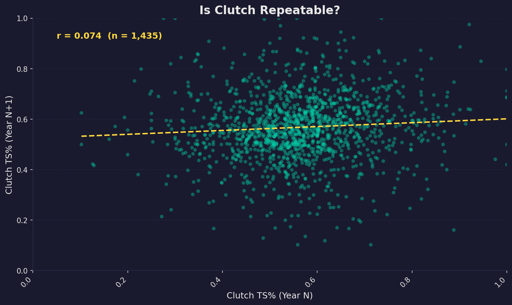

**Figure 1.** Scatter plot of clutch TS% in year N vs. year N+1. The near-flat regression line and cloud-like distribution indicate weak repeatability.

---

### 3.2 Test 2: Sample Size

| Metric | Regular Season | Playoffs |
|--------|----------------|----------|
| Avg clutch possessions/player-season | 34.5 | 11.9 |
| Median clutch possessions | 25.1 | — |
| Avg overall possessions | 817.2 | — |
| Clutch/overall ratio | 3.7% | 4.8% |
| Avg clutch games played | 23.9 | 7.3 |

**Finding:** Clutch represents only ~3.7% of a typical player's offensive workload. The average player gets ~35 clutch possessions per season—far too few to reliably estimate a "skill."

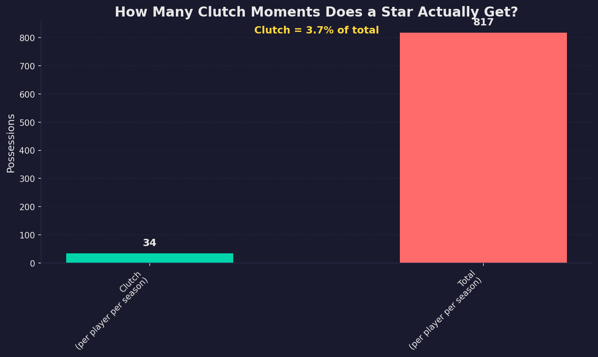

**Figure 2.** Comparison of clutch vs. total possessions per player per season.

---

### 3.3 Test 3: Clutch vs. Overall TS% (Reputation Players)

Among 22 reputation players, **19 shot worse** in clutch than overall. Only 3 (Chris Paul, Paul George, Shai Gilgeous-Alexander) shot meaningfully better (TS% diff > 0.005).

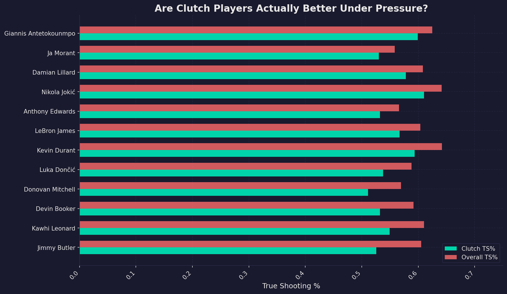

**Figure 3.** Clutch TS% vs. overall TS% for reputation players. Most bars show clutch (teal) below overall (coral).

---

### 3.4 Test 4: FT-Stripped Efficiency

When free throws are removed, many "clutch" reputations rely heavily on foul drawing. Joel Embiid, Jimmy Butler, Paul George, and Trae Young show large gaps between clutch TS% and FT-stripped efficiency.

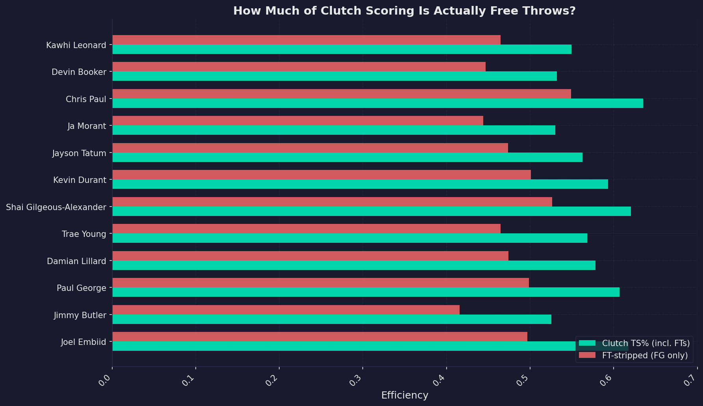

**Figure 4.** Clutch TS% (including FTs) vs. FT-stripped efficiency. Large gaps indicate FT-dependent clutch scoring.

---

### 3.5 Test 5: Usage Spike

All 22 reputation players increased their share of team shots in clutch time. Ja Morant, Jimmy Butler, Trae Young, and Donovan Mitchell showed the largest spikes (80%+ increase).

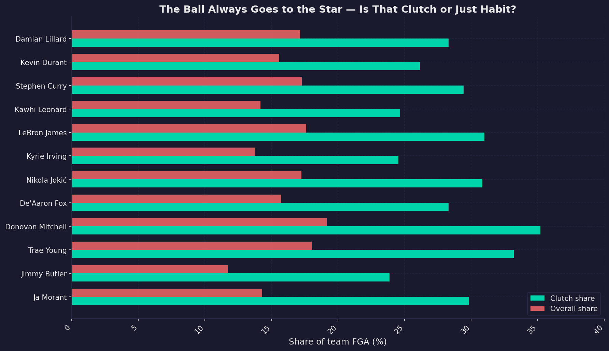

**Figure 5.** Clutch vs. overall share of team FGA. Stars take a larger share of shots in clutch—volume, not necessarily efficiency.

---

### 3.6 Test 6: Ball Movement (Assist-to-FGM Ratio)

For 21 of 22 stars, the assist-to-FGM ratio dropped in clutch vs. overall—often by 30–40%. Chris Paul's ratio fell by 46%. The offense becomes more isolation-heavy.

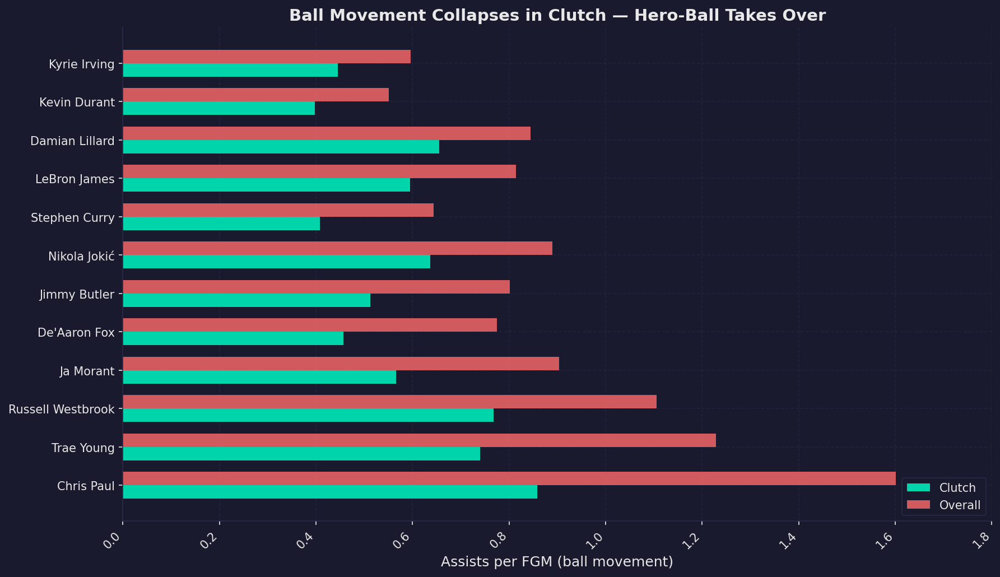

**Figure 6.** Assist-to-FGM ratio in clutch vs. overall. Lower values in clutch indicate hero-ball.

---

### 3.7 Test 7: Home vs. Away Clutch TS%

Home/road splits are mixed. Kawhi Leonard, Kyrie Irving, and Giannis shoot better at home in clutch; LeBron, Curry, Trae Young, and De'Aaron Fox shoot *worse* at home.

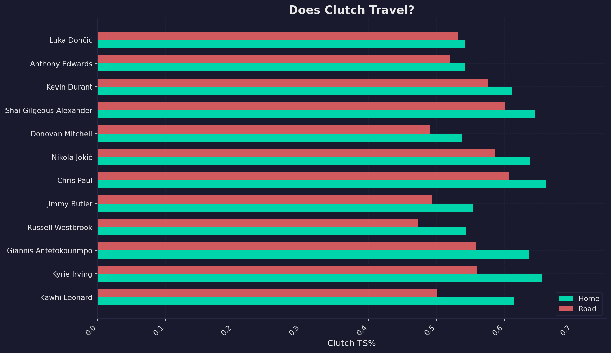

**Figure 7.** Home vs. road clutch TS% for reputation players.

---

### 3.8 Test 8: Miss Rate (Mythology Players)

For LeBron James, Kyrie Irving, and Damian Lillard—three of the most mythologized clutch players:
- LeBron: 53% miss rate
- Kyrie: 54% miss rate  
- Lillard: **60%** miss rate

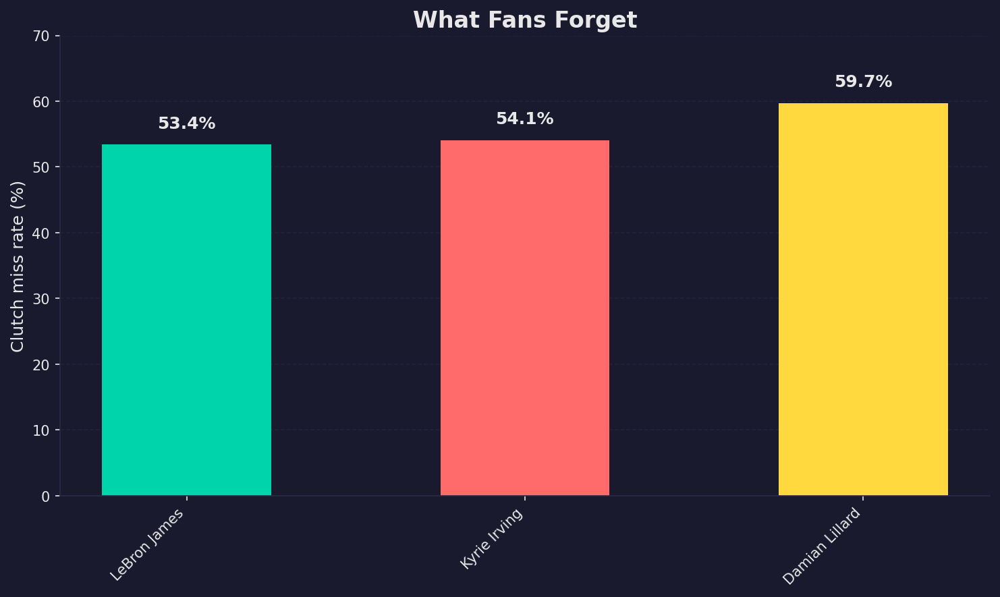

**Figure 8.** Clutch miss rate for three "clutch" icons. We remember the makes; we forget the misses.

---

### 3.9 Hidden Clutch: Non-Reputation Players

Among non-stars with ≥40 clutch games, **102 players** shot better in clutch than overall. Seventeen non-stars showed repeatable clutch performance (*r* > 0.5): Terance Mann, Jaren Jackson Jr., Ricky Rubio, Anfernee Simons, P.J. Tucker, and others.

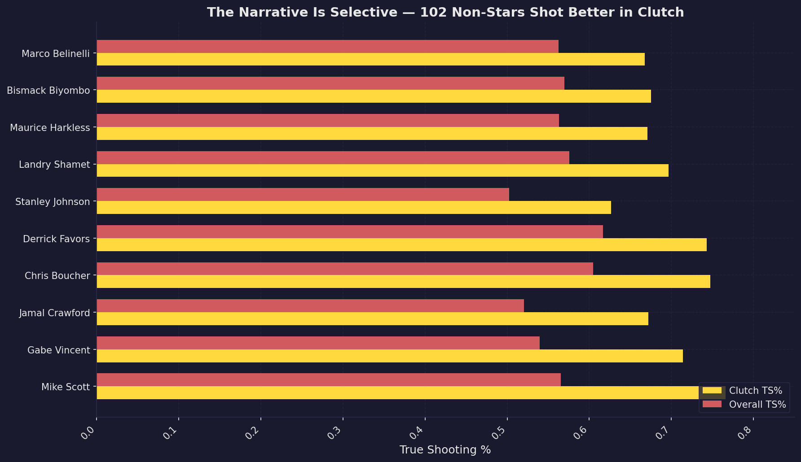

**Figure 9.** Top 10 non-reputation players who shot better in clutch than overall. The narrative is selective.

---

### 3.10 Turnover Rate

Nineteen of 22 stars turned the ball over *less* in clutch than overall. The TS% drop is not explained by panic or sloppiness—stars protect the ball better when it matters. The efficiency drop is from the shots themselves.

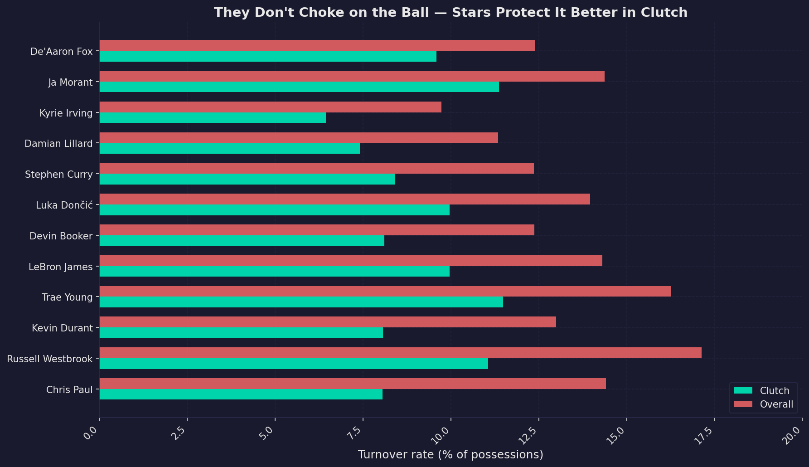

**Figure 10.** Turnover rate in clutch vs. overall. Stars protect the ball better in clutch.

---

### 3.11 The Exception: Chris Paul

Chris Paul is the only reputation player with a large, FT-independent clutch edge: 63.5% clutch TS% vs. 58.3% overall (+5.2 pp). His turnover rate also drops sharply in clutch (8.1% vs. 14.4% overall).

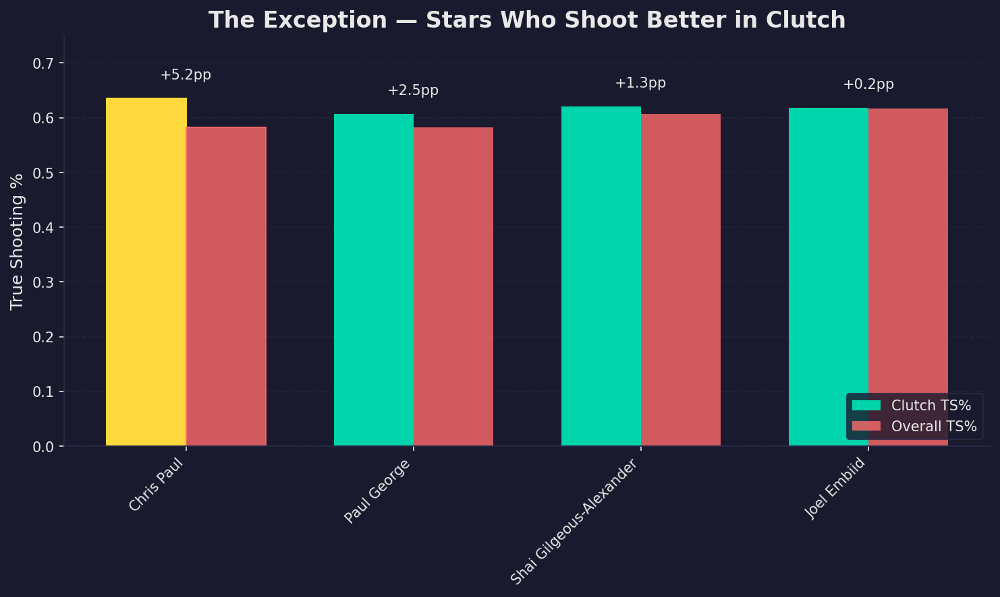

**Figure 11.** The three stars who shoot better in clutch: Chris Paul, Paul George, Shai Gilgeous-Alexander.

---

## 4. Discussion

### 4.1 Summary of Findings

1. **Repeatability:** Clutch TS% is not repeatable (*r* = 0.074). A player's clutch performance in one season predicts almost nothing about the next.

2. **Sample size:** Clutch represents ~3.7% of possessions. Too small to separate signal from noise.

3. **Stars get worse:** 19 of 22 reputation players shoot worse in clutch than overall.

4. **FT dependence:** Many "clutch" numbers are inflated by free throw volume.

5. **Usage spike:** Stars take more shots in clutch—volume and visibility, not efficiency.

6. **Ball movement:** Assist-to-FGM ratio drops 30–40% in clutch; offense becomes hero-ball.

7. **Turnovers:** Stars turn it over *less* in clutch; the TS% drop is from shot quality, not sloppiness.

8. **Narrative selectivity:** 102 non-stars shot better in clutch; 17 showed repeatable performance. The mythology ignores them.

### 4.2 Limitations

- **Sample size:** Even 8 seasons yields limited playoff data (46 YoY pairs).
- **Definition:** "Last 5 minutes, within 5" is arbitrary; other definitions may differ.
- **Confounding:** Defensive attention, coaching, and era effects are not controlled.
- **Survivorship bias:** Players who choke may get fewer clutch opportunities over time.

### 4.3 Conclusion

Clutch *moments* are real—the situation exists and matters. Clutch as a *repeatable shooting skill* does not hold up. The data suggest that what we call "clutch" is largely volume, visibility, and selective memory. The ball goes to the star; he shoots; we remember the makes and forget the misses.

---

## 5. References

- NBA.com/stats — Official NBA statistics API
- Basketball-Reference — True Shooting % formula
- Scipy (Python) — Pearson correlation, statistical tests

---

## Appendix A: Reputation Player List (22)

LeBron James, Damian Lillard, Kawhi Leonard, Kyrie Irving, Jimmy Butler, Chris Paul, Stephen Curry, Luka Doncic, Devin Booker, Paul George, Kevin Durant, Giannis Antetokounmpo, Jayson Tatum, Donovan Mitchell, Shai Gilgeous-Alexander, Trae Young, Ja Morant, Joel Embiid, Anthony Edwards, De'Aaron Fox, Russell Westbrook, Nikola Jokic

---

## Appendix B: File Outputs

| File | Description |
|------|-------------|
| `phase2_results.json` | YoY correlation, sample size, TS% summary |
| `phase2_yoy_pairs.csv` | Year N / Year N+1 clutch TS% pairs |
| `phase3_test3_ts_comparison.csv` | Clutch vs overall TS% (reputation) |
| `phase3_test4_ft_stripped.csv` | FT-stripped efficiency |
| `phase3_test5_usage_spike.csv` | FGA share spike |
| `phase4_test6_assist_ratio.csv` | Assist-to-FGM ratio |
| `phase4_test7_home_away.csv` | Home vs road clutch TS% |
| `phase4_test8_miss_rate.csv` | Miss rate (mythology players) |
| `turnover_rate_clutch.csv` | TOV rate clutch vs overall |
| `hidden_clutch_better.csv` | Non-stars who shot better in clutch |
| `hidden_clutch_repeatable.csv` | Non-stars with r > 0.5 |
| `playoff_results.json` | Playoff YoY and sample size |
